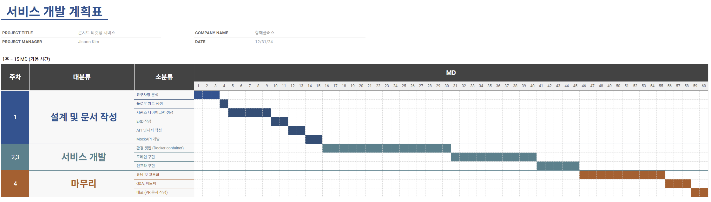
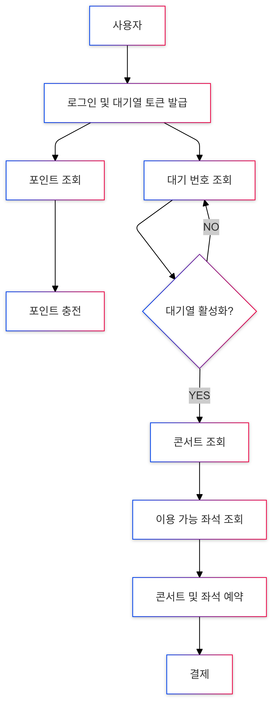

# 프로젝트 마일스톤

# 프로젝트 요구사항 및 분석
### 1. 유저 대기열 토큰 기능
- 서비스를 이용할 토큰을 발급받는 API를 작성합니다.
- 토큰은 유저의 UUID 와 해당 유저의 대기열을 관리할 수 있는 정보 ( 대기 순서 or 잔여 시간 등 ) 를 포함합니다.
  - **요구사항 분석 ( UUID vs 토큰 )**
    - UUID는 사용자가 로그인했음을 인증하는 도구라고 정의했다.
    - 토큰은 사용자가 대기열에서 대기하기 위한 도구라고 정의했다.
      ( 토큰은 다수 인스턴스를 고려하여 DB를 통해 관리되며 waiting_queue 테이블의 row를 지칭한다. )
      ( 즉, 토큰은 UUID와 대기 순서 정보를 가진 row를 말한다. )
- 이후 모든 API 는 위 토큰을 이용해 대기열 검증을 통과해야 이용 가능합니다.
  - **요구사항 분석**
    - 토큰 검증은 대기열이 활성화 상태인지 확인하는 과정이라고 가정했다.
      ( 대기열의 활성화는 대기번호가 0보다 작거나 같음을 의미한다고 정의했다. )
      ( 대기열의 대기는 대기번호가 0보다 큼을 의미한다고 정의했다. )
    - 좌석 조회, 예약, 결제 등 대기열이 필요한 기능들에 대해서는 토큰 검증을 통과해야한다고 생각했다.
    - 포인트 조회, 충전 등 대기열이 필요하지 않은 기능들에 대해서는 토큰 검증을 수행하지 않되, UUID를 검증하여 로그인 여부를 확인해야한다고 생각했다.
      ( 즉, 토큰을 발급받아야 로그인(UUID 생성)을 수행하기 때문에 토큰을 발급받은 후에 이용할 수 있을 것이라고 생각했다. )
    - 대기열 토큰을 발급받았지만 포인트 조회, 충전 등 대기열이 필요없는 기능들만 수행할 경우를 대비해 토큰의 유효기간(10분)을 두어 대기열 토큰이 낭비되는 것을 방지해야 한다.
- 폴링으로 본인의 대기열을 확인한다고 가정
  - **요구사항 분석**
    - 앞의 대기번호를 가진 클라이언트가 폴링을 중단할 경우에 뒤의 대기번호를 가진 클라이언트가 무한정 기다려야하는 상황이 발생할 수 있을 것을 고려해 어떤 클라이언트의 요청이던 모든 대기열 토큰을 확인할 수 있도록 구현해야한다.

### 2. 예약 가능 날짜 / 좌석 API
- 예약가능한 날짜와 해당 날짜의 좌석을 조회하는 API 를 각각 작성합니다.
- 예약 가능한 날짜 목록을 조회할 수 있습니다.
- 날짜 정보를 입력받아 예약가능한 좌석정보를 조회할 수 있습니다.
- 좌석 정보는 1 ~ 50 까지의 좌석번호로 관리됩니다.
  - **요구사항 분석**
    - 좌석 수(50)가 상대적으로 작으므로 콘서트 생성시 모든 좌석을 생성할 수 있다고 생각했다.
      ( 좌석 수가 작으므로 좌석 예약 시마다 좌석을 삽입하는 방식에 비해 미리 생성하여 예약시 갱신하는 방식이 효율적이라고 생각했다. )
      ( 콘서트 정보의 수정이 잦을 경우에, 좌석 정보의 수정에 영향을 끼치지 않도록 좌석테이블과 콘서트테이블을 분리하여야 한다고 생각했다. )

### 3. 좌석 예약 요청 API
- 날짜와 좌석 정보를 입력받아 좌석을 예약 처리하는 API 를 작성합니다.
  - **요구사항 분석**
    - 한 날짜에는 한 콘서트만이 개최된다고 가정했다.
- 좌석 예약과 동시에 해당 좌석은 그 유저에게 약 5분간 임시 배정됩니다.
- 만약 배정 시간 내에 결제가 완료되지 않는다면 좌석에 대한 임시 배정은 해제되어야 하며 이후 다른 사용자가 예약할 수 있어야 한다.
  - **요구사항 분석**
    - 예약 테이블 내에 expiration_time 컬럼을 두어 임시 배정 시간의 초과를 확인하는 방식을 선택했다.

### 4. 잔액 충전 / 조회 API
- 결제에 사용될 금액을 API 를 통해 충전하는 API 를 작성합니다.
- 사용자 식별자 및 충전할 금액을 받아 잔액을 충전합니다.
- 사용자 식별자를 통해 해당 사용자의 잔액을 조회합니다.
  - **요구사항 분석**
    - 로그인한 사용자만이 잔액 조회 / 충전을 수행할 수 있다고 가정했다.

### 5. 결제 API
- 결제 처리하고 결제 내역을 생성하는 API 를 작성합니다.
- 결제가 완료되면 해당 좌석의 소유권을 유저에게 배정하고 대기열 토큰을 만료시킵니다.
  - **요구사항 분석**
    - 결제를 완료하지 않을 경우 대기열 토큰이 남아있는 것을 고려하여 유효기간(10분)을 두어 낭비를 방지해야한다.

# 사용자 입장의 플로우차트

# 시퀀스 다이어그램
### 토큰 발급

### 예약가능 콘서트 및 좌석 조회

### 콘서트 예약 및 결제

### 포인트 조회 및 충전

